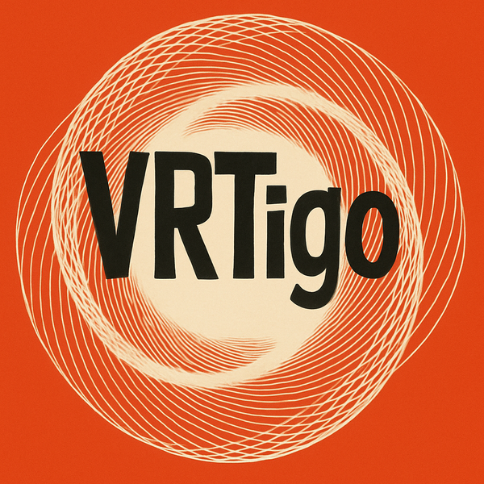

  

# VRTigo

An experimental C++20 VRT I/O library co-authored with AI

## Overview

Header-only, allocation-free C++20 library for building and parsing VITA 49.2 VRT packets. Includes Python bindings and optional CUDA support.

See [DEVELOPMENT.md](DEVELOPMENT.md) for build instructions, architecture, and development conventions.

## Documentation

- [Documentation Index](docs/README.md) — Top-level guide to the user-facing docs
- [Quickstart Guide](docs/quickstart.md) — Executable examples for data packets, context packets, file I/O, and parsing
- [Python Bindings](docs/python-bindings.md) — Python packet, reader, and time-type overview
- [Timestamp Math](docs/timestamp-math.md) — Picosecond-accurate time arithmetic
- [CIF Field Access](docs/cif_access.md) — Context Information Field accessors
- [I/O Helpers](docs/utils/io-helpers.md) — File, PCAP, and UDP readers/writers
- [GPU Extensions](docs/gpu-extensions.md) — CUDA-compatible packet parsing
- [Endianness Model](docs/endianness-model.md) — Byte-order handling

